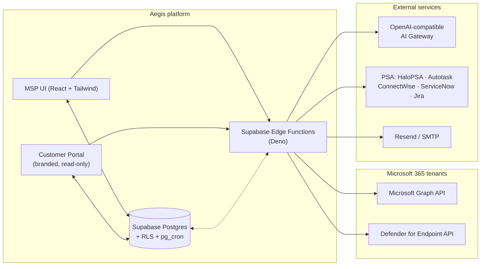

<div align="center">

# Aegis

### AI-powered Microsoft 365 governance, security, and compliance — built for MSPs.

Multi-customer · multi-tenant · open-source under MIT.

[](./LICENSE)
[](https://github.com/anthonyonazure/aegis/actions/workflows/ci.yml)
[](https://github.com/anthonyonazure/aegis/releases)
[](https://github.com/anthonyonazure/aegis/issues)
[](https://github.com/anthonyonazure/aegis/stargazers)

[](https://react.dev)
[](https://www.typescriptlang.org)
[](https://vitejs.dev)
[](https://tailwindcss.com)
[](https://supabase.com)
[](https://learn.microsoft.com/graph)

**[Quick Start](#-quick-start)** · **[Features](#-features)** · **[Compliance](#-compliance--audit)** · **[Documentation](./HANDOFF.md)** · **[Contributing](./CONTRIBUTING.md)** · **[Discussions](https://github.com/anthonyonazure/aegis/discussions)**

---

</div>

## Why Aegis

Most MSP M365 tooling is read-only dashboards or pre-AI scripting platforms. **Aegis is built differently:** every workflow an MSP runs against Microsoft 365 drift detection, anomaly response, policy generation, compliance evidence has AI woven through it, with safety controls and audit trails designed to survive a security review rather than bypass one.

Designed for the operator running 5–500 customers who needs **leverage**, not just visibility.

| | |
|---|---|
| 🛡️ **Multi-tenant by default** | Customer-aware data model from day one. Every query is scoped; nothing leaks between customers. |
| 🤖 **AI throughout** | 24+ AI workflows backed by real Graph data. Anomaly detection, policy generation, drift narration, compliance reasoning. |
| 📋 **Audit-ready** | 6 compliance frameworks (HIPAA, SOC 2, CMMC, NIST 800-53, ISO 27001, PCI DSS). Downloadable audit packages with PDF cover and per-control snapshots. |
| 🎨 **White-label portal** | Customer-facing read-only portal at `<slug>.<your-host>` or their own `portal.acme.com`, branded per customer. |
| 🔌 **Pluggable** | PSA integrations (HaloPSA, Autotask, ConnectWise, ServiceNow, Jira). Marketplace for policy templates and AI workflows. |
| 🔐 **Safe by design** | Every new table ships with RLS policies. Customer-owned data never leaves your Supabase project. BYOK supported for every AI provider. |

---

## 📸 Screenshots

| Threat Intelligence Browser | AI Anomaly Detection |
|:---:|:---:|
|  |  |
| MISP-inspired catalog: 38 ATT&CK techniques, 15 threat actors, 20 IOCs, 20 galaxies, 14 OSINT feeds, 4 taxonomies. | Live sign-in / config / permission anomaly scanning across every connected tenant. |

---

## 🚀 Quick Start

```bash
git clone https://github.com/<your-fork>/aegis.git
cd aegis

npm install
cp .env.example .env    # fill in your Supabase URL + publishable key
npm run dev             # → http://localhost:8080
```

Then deploy backend (migrations + edge functions) in one command:

```powershell
# Windows
.\scripts\deploy-aegis.ps1
```

```bash
# macOS / Linux / WSL
./scripts/deploy-aegis.sh
```

See [the full deployment runbook](./HANDOFF.md) for DNS / SSL / cron setup.

---

## 🛠️ Architecture



- **Frontend** is a single React SPA. MSP routes get full Tenant + Branding context; portal routes (`/portal/*` or custom hosts) are isolated and read-only.
- **Edge functions** (Deno) handle Graph calls, AI orchestration, scheduled jobs, and webhook fan-out. Every function enforces auth + ownership.
- **Postgres** with Row-Level Security on every table; `pg_cron` triggers scheduled compliance + DUDE runs.
- **Bring your own AI** — point `AI_GATEWAY_URL` at any OpenAI-compatible endpoint (OpenAI, Azure OpenAI, OpenRouter, your own proxy). Or use BYOK per-feature for direct Anthropic / Google / Mistral / Groq.

---

## 🎯 Features

<details>
<summary><b>Governance & Configuration</b></summary>

- **Tenant Health** — connection health, API status, license usage across every connected tenant
- **Resource Explorer** — browse and select M365 resources across 11 categories (Intune, Conditional Access, Entra ID, Exchange, SharePoint, Teams, etc.)
- **Export Configuration** — tenant settings exported to JSON / Terraform / Bicep / PowerShell
- **Import & Restore** — restore configurations from previous exports or migrate between tenants
- **Policy Templates** — reusable policy definitions for consistent deployments across customers
- **Customer Management** — group multiple tenants under MSP customers; org chart, contacts, PSA ticket links

</details>

<details>
<summary><b>Intune & Device Management</b></summary>

- **Intune Manager** — centralized device, app, policy, and configuration management across tenants
- **DUDE Sync** — Dynamic User & Device Enumeration. Auto-tag Defender devices and sync user-group → device-group membership with transitive resolution, blast-radius limiter, prefix allowlists, dry-run-by-default, scheduled execution, and AU user sync. Concept inspired by Daniel Petri's 😊 [DUDE-Manager](https://github.com/danielpetri666/DUDE-Manager) (MIT).

</details>

<details>
<summary><b>Threat Intelligence & Forensics</b></summary>

- **MISP Browser** — local threat intel browser with curated ATT&CK techniques, IOCs, threat actor profiles, OSINT feeds
- **Hawk Forensics** — incident forensics workflow leveraging Microsoft Hawk
- **Email Security** — outbound + inbound posture monitoring, transport rule audit
- **Reference Catalog** — 38 ATT&CK Techniques · 20 Galaxy Clusters · 14 OSINT Feeds · 4 Taxonomies built in

</details>

<details>
<summary><b>AI Workflows (24+)</b></summary>

| Workflow | What it does |
|---|---|
| **Tenant Analyzer** | Natural-language Q&A across tenant configurations |
| **AI Query** | Cross-tenant natural-language search |
| **AI Chat** | Conversational interface to your tenant data |
| **Cross-Tenant Insights** | Patterns and anomalies across the customer book |
| **Policy Generator** | Generate Conditional Access, Intune compliance, configuration policies from prompts |
| **Remediation Scripts** | PowerShell / Graph remediation for detected issues |
| **Change Impact** | Predict downstream impact of proposed policy changes |
| **Anomaly Detection** | Sign-in, config-change, and permission-grant anomalies |
| **Incident Responder** | Guided incident response with Graph-based evidence collection |
| **User Risk Profiler** | Risk-score users from sign-in behavior, app consent, group membership |
| **Drift Detection + Drift Explainer** | Detect and narrate configuration drift in plain English |
| **Security Predictor / Benchmark** | Predict incidents and benchmark against industry baselines |
| **Compliance Advisor** | Map findings to control requirements |
| **License Optimizer** | Spot underutilized SKUs |
| **Cost Predictor** | Forecast license + Copilot consumption |
| **Migration Planner** | Plan tenant-to-tenant migrations |
| **Copilot Readiness Advisor** | Score and remediate readiness for Copilot rollout |
| **Executive Reports** | One-click stakeholder-facing summaries |

Multi-LLM provider support: bring-your-own-key for OpenAI · Anthropic · Google · Azure OpenAI · OpenRouter · Groq · Mistral · Perplexity · plus a built-in OpenAI-compatible gateway.

</details>

<details>
<summary><b>Customer Portal (white-label)</b></summary>

- **Subdomain routing** — `<customer-slug>.<your-base-host>`
- **Custom domain** — `portal.acme.com` with DNS verification
- **Branded shell** — logo, primary/accent colors, support contacts per customer
- **Read-only views** — secure score, drift findings, anomaly history (RLS-scoped to that customer's tenants only)
- **Email-based portal user invites** — magic link redirected at the customer's portal sign-in

</details>

<details>
<summary><b>Marketplace + Plugin SDK</b></summary>

- **Policy Templates Marketplace** — publish + install community-shared policy templates with star ratings and install counts
- **Plugin SDK** — author AI workflows as `{prompt template, input schema, optional tenant-context flag}`. Run, share publicly, install someone else's into your library

</details>

---

## 📋 Compliance & Audit

Six frameworks, ~46 controls, all backed by the same evaluator code that runs against live tenant configuration.

| Framework | Version | Controls | Evaluators |
|---|---|---|---|
| HIPAA Security Rule | 45 CFR 164 | 5 | ✅ Auto |
| SOC 2 Trust Services Criteria | 2017 (rev. 2022) | 6 | ✅ Auto |
| CMMC Level 2 | v2.0 | 9 | ✅ Auto |
| NIST SP 800-53 | Rev. 5 (Moderate) | 11 | ✅ Auto |
| ISO/IEC 27001 Annex A | 2022 | 8 | ✅ Auto |
| PCI DSS | v4.0 (M365 subset) | 8 | ✅ Auto |

Each run produces a downloadable ZIP:

```
acme_2026-04-29_evidence_package.zip
├── cover.pdf           ← auditor-facing summary, color-coded control table
├── manifest.json       ← machine-readable run metadata
├── narratives.md       ← (optional) AI-generated plain-English explanations of failed controls
└── controls/
    ├── 164.312(d).json ← per-control raw snapshot (the actual evidence)
    └── …
```

Schedule recurring collection per (framework, target tenants, cadence). pg_cron pings the runner every 15 min.

---

## 💻 Tech Stack

| Layer | Technology |
|---|---|
| **Frontend** | React 18 · TypeScript · Vite · Tailwind CSS · shadcn/ui · TanStack React Query |
| **Backend** | Supabase (Auth · PostgreSQL · Edge Functions · pg_cron) |
| **M365** | Microsoft Graph API · Defender for Endpoint API |
| **AI** | Multi-provider via OpenAI-compatible gateway · BYOK for direct provider access |
| **PSA** | HaloPSA · Autotask · ConnectWise · ServiceNow · Jira |
| **Email** | Resend (configurable) |
| **Threat intel** | MISP-format ingestion |

---

## ⚙️ Configuration

### Frontend env (`.env`)

| Variable | Description |
|---|---|
| `VITE_SUPABASE_URL` | Your Supabase project URL |
| `VITE_SUPABASE_PUBLISHABLE_KEY` | The `anon` / publishable key |
| `VITE_SUPABASE_PROJECT_ID` | Project ref (diagnostics only) |
| `VITE_PORTAL_BASE_HOST` | *Optional* — base host for subdomain portal routing (e.g. `aegis.io`) |

### Supabase edge function secrets

| Variable | Description |
|---|---|
| `AI_GATEWAY_API_KEY` | API key for the AI gateway |
| `AI_GATEWAY_URL` | OpenAI-compatible chat-completions endpoint |
| `RESEND_API_KEY` | *Optional* — outbound notification emails |
| `CUSTOM_DOMAIN_CNAME_TARGET` | *Optional* — for customer-owned portal domains |
| `CUSTOM_DOMAIN_A_TARGETS` | *Optional* — apex-domain fallback |

Per-provider keys (`OPENAI_API_KEY`, `ANTHROPIC_API_KEY`, etc.) are optional fallbacks; users can also supply their own via the in-app provider settings (BYOK).

---

## 🗺️ Roadmap

### Shipped

- ✅ White-label per-MSP branding
- ✅ Webhook → ServiceNow / Jira / ConnectWise / HaloPSA / Autotask on detected anomalies
- ✅ Customer-facing read-only portal (subdomain + custom-domain routing, branded per customer, email-invite flow)
- ✅ Automated HIPAA / SOC 2 / CMMC / NIST 800-53 / ISO 27001 / PCI DSS evidence collection
- ✅ Downloadable audit packages with PDF cover + AI-generated narratives + per-control JSON
- ✅ Public marketplace for shared Policy Templates with ratings
- ✅ Plugin SDK for community-contributed AI workflows
- ✅ DUDE Sync — full parity with Daniel Petri's DUDE-Manager (prefix allowlists, dry-run-by-default, MDE tagging, scheduled execution, AU user sync)

### Open ideas

- [ ] Slack / Teams app surfaces for the customer portal
- [ ] More evaluator coverage per existing framework (e.g. tenant-wide MFA, smart lockout)
- [ ] Threat-intel correlation: when an anomaly fires, surface matching MISP indicators
- [ ] Multi-region deployment guide
- [ ] Self-hosted Supabase deployment guide
- [ ] More PSA providers (Kaseya BMS, SuperOps, Atera)

Have an idea? [Open an issue](https://github.com/anthonyonazure/aegis/issues/new/choose) or start a [Discussion](https://github.com/anthonyonazure/aegis/discussions).

---

## 🤝 Contributing

Contributions welcome — see [CONTRIBUTING.md](./CONTRIBUTING.md) for development setup, coding conventions, the PR process, and "how to add a compliance evaluator" / "how to publish a marketplace plugin" recipes.

Looking for an entry point? Issues labelled [`good first issue`](https://github.com/anthonyonazure/aegis/labels/good%20first%20issue) and [`help wanted`](https://github.com/anthonyonazure/aegis/labels/help%20wanted) are sized for first-time contributors.

For security issues, **don't** open a public issue — see [SECURITY.md](./SECURITY.md).

---

## 📂 Project structure

```
aegis/
├── src/
│   ├── components/
│   │   ├── ai/             # AI provider settings, AI chat, prompt templates
│   │   ├── compliance/     # Compliance schedule UI
│   │   ├── customers/      # MSP-side customer management + branding + portal users
│   │   ├── layout/         # Sidebar, app shell
│   │   ├── portal/         # Customer-facing portal components
│   │   └── views/          # Top-level page components keyed by tab id
│   ├── contexts/           # TenantContext · BrandingContext · PortalHostContext
│   ├── hooks/              # Custom hooks (usePageTitle, useTenant, useResourceSelection, …)
│   ├── lib/                # Database wrappers, Graph helpers, package generators
│   ├── pages/              # Top-level routes
│   └── types/              # Shared TypeScript types
├── supabase/
│   ├── migrations/         # Postgres migrations (timestamp-prefixed)
│   ├── functions/          # 30+ Deno edge functions
│   └── config.toml         # Supabase project config
├── scripts/
│   ├── deploy-aegis.ps1    # One-shot deploy (Windows)
│   ├── deploy-aegis.sh     # One-shot deploy (macOS / Linux)
│   └── post-deploy.sql     # SQL to run after deploy (cron jobs, data migrations)
├── docs/
│   └── screenshots/        # Capture targets
├── .github/                # CI · issue templates · PR template
├── HANDOFF.md              # Full deployment runbook (35+ items)
├── CHANGELOG.md            # Keep a Changelog format, SemVer-ish pre-1.0
├── RELEASING.md            # Release process
├── SECURITY.md             # Security policy + disclosure
└── CONTRIBUTING.md         # Development setup, conventions, PR flow
```

---

## 🙏 Acknowledgements

- **Daniel Petri's [DUDE-Manager](https://github.com/danielpetri666/DUDE-Manager)** — the canonical PowerShell + WPF reference for Dynamic User & Device Enumeration. Aegis's port mirrors the design (transitive membership, blast-radius limiter, prefix allowlists, AU + Defender automation) on a Supabase + React stack.
- The **Microsoft Graph** and **Defender for Endpoint** API teams for surfacing the underlying capabilities Aegis orchestrates.
- The **MISP Project** for the threat-intelligence taxonomies seeded in our reference catalog.
- The **shadcn/ui**, **Tailwind**, **Supabase**, and **Deno** maintainers — we stand on a lot of OSS.

---

## 📜 License

[MIT](./LICENSE) © 2026 Aegis contributors

---

<div align="center">

**[⬆ Back to top](#aegis)**

</div>
