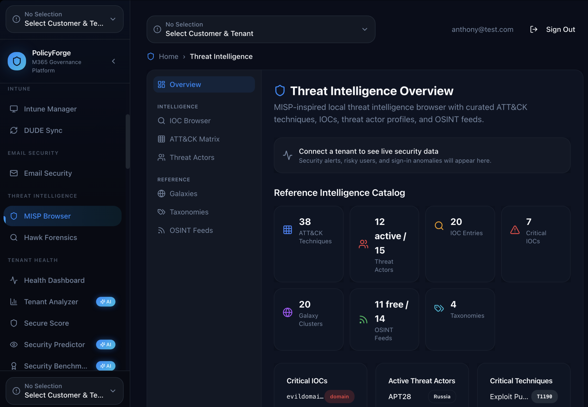
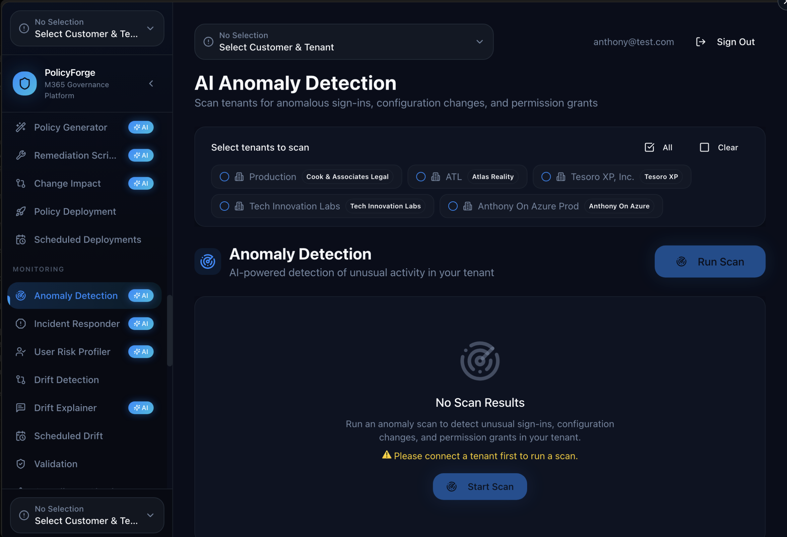

# PolicyForge

> **AI-native Microsoft 365 governance for MSPs.** Multi-customer, multi-tenant, with AI woven through anomaly detection, policy generation, threat intelligence, drift detection, and incident response. The platform Vortex-class MSPs build their AI service line on.


---

## What it is

Most MSP M365 tooling is read-only dashboards or pre-AI scripting platforms. PolicyForge is built differently: **multi-customer, multi-tenant, AI-augmented across every workflow** that an MSP runs against Microsoft 365.

Production-grade today: 5 customers loaded, 8 tenants connected, 45 successful tenant exports, full Graph API integration. Built for the operator running 5–500 customers who needs leverage, not just visibility.

## Capability Surface

### Governance & Configuration
- **Tenant Health** — connection health, API status, license usage across every connected tenant
- **Resource Explorer** — browse and select M365 resources across 11 categories (Intune, Conditional Access, Entra ID, Exchange, SharePoint, Teams, etc.)
- **Export Configuration** — tenant settings exported to JSON / Terraform / Bicep / PowerShell. 45 exports / 4 formats.
- **Import & Restore** — restore configurations from previous exports or migrate between tenants
- **Policy Templates** — reusable policy definitions for consistent deployments across customers
- **Customer Management** — group multiple tenants under MSP customers; org chart, contacts, PSA ticket links

### Intune Management
- **Intune Manager** — centralized device, app, policy, and configuration management across tenants
- **DUDE Sync** — sync customer / tenant / billing data with N-able DUDE / PSA integrations

### Threat Intelligence
- **MISP Browser** — local threat intel browser with curated ATT&CK techniques, IOCs, threat actor profiles, OSINT feeds
- **Hawk Forensics** — incident forensics workflow leveraging Microsoft Hawk
- **Reference Catalog** — 38 ATT&CK Techniques, 20 Galaxy Clusters, 14 OSINT Feeds, 4 Taxonomies built in

### Email Security
- **Email Security** — outbound + inbound posture monitoring, transport rule audit

### Tenant Health & AI
- **Health Dashboard** — cross-tenant health overview
- **Tenant Analyzer** *(AI)* — natural-language Q&A across tenant configurations
- **Secure Score** — Microsoft Secure Score tracked over time per tenant
- **Security Predictor** *(AI)* — predicts likely security incidents from current posture
- **Security Benchmark** *(AI)* — benchmarks tenant against industry baselines

### AI Workflows (the differentiator)
- **AI Query** — natural-language query across all connected tenants
- **AI Chat** — conversational interface to your tenant data
- **Cross-Tenant Insights** *(AI)* — patterns and anomalies across the customer book
- **Policy Generator** *(AI)* — generate Conditional Access, Intune compliance, and configuration policies from natural-language requirements
- **Remediation Scripts** *(AI)* — generate PowerShell / Graph remediation for detected issues
- **Change Impact** *(AI)* — predict downstream impact of proposed policy changes before applying
- **Anomaly Detection** *(AI)* — scan tenants for anomalous sign-ins, configuration changes, permission grants
- **Incident Responder** *(AI)* — guided incident response with Graph-based evidence collection
- **User Risk Profiler** *(AI)* — risk-score users based on sign-in behavior, app consent, group membership
- **Drift Detection** + **Drift Explainer** *(AI)* — detect and explain configuration drift between baseline and current state
- **Validation** — validate tenant state against compliance baselines before deployment

### Multi-LLM Provider Support
PolicyForge supports multiple AI providers — bring-your-own-key for Anthropic Claude, OpenAI, Azure OpenAI, Google Gemini, plus a built-in default option. Choose providers per workflow.

## Screenshots

> _Captures live in `docs/screenshots/`. See [docs/SCREENSHOTS.md](docs/SCREENSHOTS.md)._

| Dashboard | Threat Intelligence | AI Anomaly Detection |
|---|---|---|
|  |  |  |

## Tech Stack

| Layer | Technology |
|---|---|
| Frontend | React 18, TypeScript, Vite 6 |
| Styling | Tailwind CSS, shadcn/ui |
| State | TanStack React Query |
| Backend | Supabase (Auth, PostgreSQL, Edge Functions) |
| M365 integration | Microsoft Graph API (Intune, Entra, Exchange, SharePoint, Teams) |
| AI providers | Multi-provider (Anthropic, OpenAI, Azure OpenAI, Gemini, built-in) |
| PSA integration | DUDE Sync (N-able compatible) |
| Threat intel | MISP-format ingestion |
| Routing | react-router-dom v6 |

## Quick Start

```bash
git clone git@github.com:anthonyonazure/policyforge.git
cd policyforge

bun install
cp .env.example .env    # fill in Supabase + Graph API + AI provider keys
bun run dev             # http://localhost:8080
```

You'll need:
- An Azure app registration with appropriate Graph API permissions for the modules you intend to enable
- Supabase project (or local instance)
- API keys for at least one AI provider (or use the built-in default)

## Project Structure

```
src/
  components/
    ai/                    AI provider settings, AI chat, prompt templates
    views/                 Major view components per feature module
    ...                    
  pages/                   Top-level routes
  integrations/            Graph API, AI providers, Supabase, DUDE/PSA
  hooks/, lib/, types/
supabase/
  migrations/              Schema for customers, tenants, policies, exports, audit
  functions/               Edge functions (Graph proxies, AI calls, scheduled scans)
docs/
  initial-plan.md          Product spec history
  screenshots/             Capture targets
```

## Roadmap

- [ ] Public marketplace for shared Policy Templates across MSPs
- [ ] White-label per-MSP branding (already supports multi-customer; add branding)
- [ ] Webhook → ServiceNow / Jira / ConnectWise on detected anomalies
- [ ] Customer-facing read-only portal (clients see their own posture without seeing other tenants)
- [ ] Automated CMMC / HIPAA / SOC 2 evidence collection scheduling
- [ ] Plugin SDK for community-contributed AI workflows

## License

Proprietary. All rights reserved.
